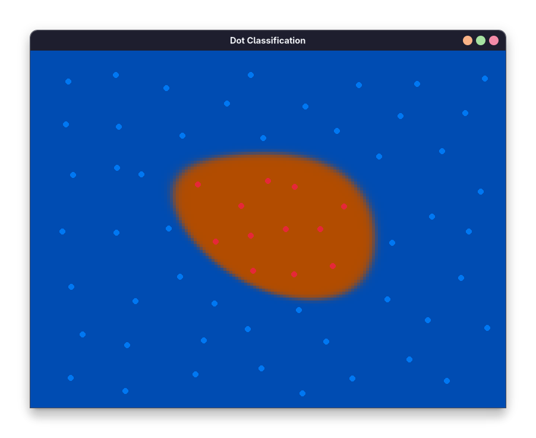

# 1. Dot classification


Press LMB (the left mouse button) to place orange dots and RMB (the right mouse button) to place blue dots. The network will learn their placement pattern in real time. You may tweak the network in the `dot-classification/src/main.rs` file.

Run this command from the project root to launch this example:

``` shell
cargo run -p dot-classification --release
```

Release mode is preferred for speed.